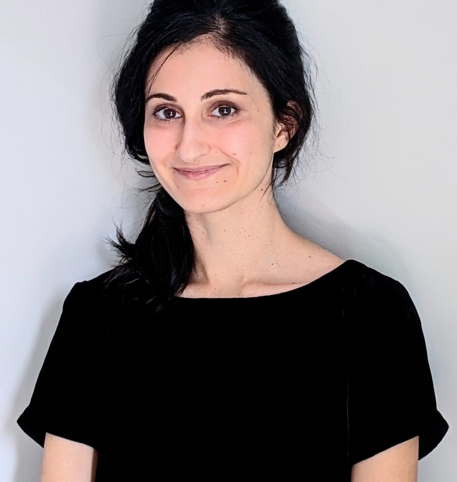
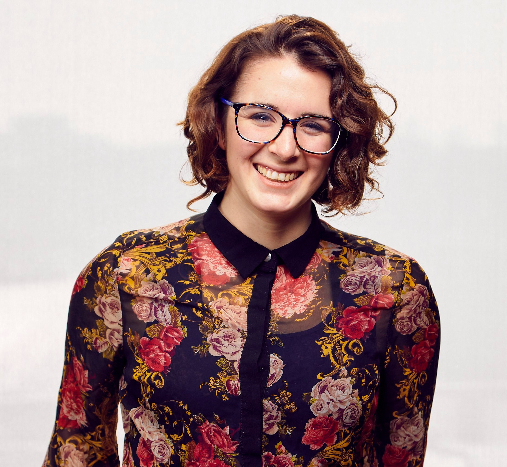

# Speakers

[**Ava Amini**](https://avaamini.com/) is a Senior Researcher at Microsoft Research, New England. Her research focuses on developing new computational technologies for precision medicine, where she works at the interface of machine learning and biophysics. She completed her PhD in Biophysics at Harvard University, where she was supported by the NSF Graduate Research Fellowship, and her SB in Computer Science and Biology at MIT. Ava is passionate about machine learning outreach and leadership: she is a co-founder of MomentumAI, which provides all-expenses-paid programs for high schoolers to learn AI, and was a lead organizer and instructor for MIT Introduction to Deep Learning.

[**Yasaman Bahri**](https://sites.google.com/view/yasamanbahri/home) is a Research Scientist at Google Research working at the interface of machine learning and physical science. Her recent work has focused on developing foundations for deep learning via the study of overparameterized neural networks and statistical mechanics approaches. She received her Ph.D. in physics, in the area of theoretical condensed matter, from the University of California, Berkeley. She was an invited lecturer at the Les Houches School of Physics (2022) and is a recipient of the Rising Stars Award in EECS (2020).

[**Michael Bronstein**](https://www.cs.ox.ac.uk/people/michael.bronstein/) is the DeepMind Professor of AI at the University of Oxford and Head of Graph Learning Research at Twitter. He was previously a professor at Imperial College London and held visiting appointments at Stanford, MIT, and Harvard. Michael received his PhD from the Technion in 2007. He is the recipient of the Royal Society Wolfson Research Merit Award, Royal Academy of Engineering Silver Medal, five ERC grants, two Google Faculty Research Awards, and two Amazon AWS ML Research Awards. In addition to his academic career, Michael is a serial entrepreneur and founder of multiple startup companies, including Novafora, Invision (acquired by Intel in 2012), Videocites, and Fabula AI (acquired by Twitter in 2019).

[**Siddhartha Mishra**](https://math.ethz.ch/sam/the-institute/people/siddhartha-mishra.html) is currently Professor for Applied Mathematics at SAM, D-MATH, ETH Zurich. The research interests of his group are in the design, analysis and implementation on state of the art HPC platforms, of efficient algorithms for PDE based simulation. The group applies these algorithms in the context of computational fluid dynamics, computational astrophysics, computational geophysics and climate science. For his research, Siddhartha Mishra has received the Collatz Prize of the International Council of Industrial and Applied Mathematics (ICIAM) in 2019, the Jacques Louis Lions Medal of ECCOMASS in 2018, Richard von Mises prize of GAMM in 2015 and the starting grant (2012) and consolidator grant (2017) of the European Research Council (ERC).

[**Kimberly Stachenfeld**](https://neurokim.com/) is a Senior Research Scientist at DeepMind. Her research lies at the interface of machine learning and neuroscience, and focuses on how brains and machines learn to predict future events. She is particularly interested in the process of learning structured models that support generalization and flexible reasoning. Recently, she has been interested in applying graph neural networks to learn physical simulations, in particular fluid simulation. Kimberly received her PhD in Neuroscience from Princeton University in 2018, and her BS/BA in Chemical & Biological Engineering and Mathematic from Tufts University in 2013. She was named one of the MIT Technology Review 35 Under 35 in 2019.

